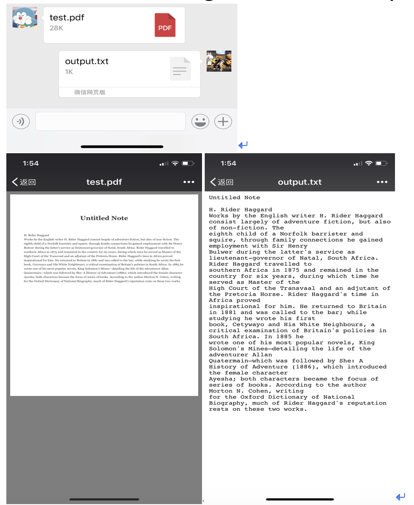
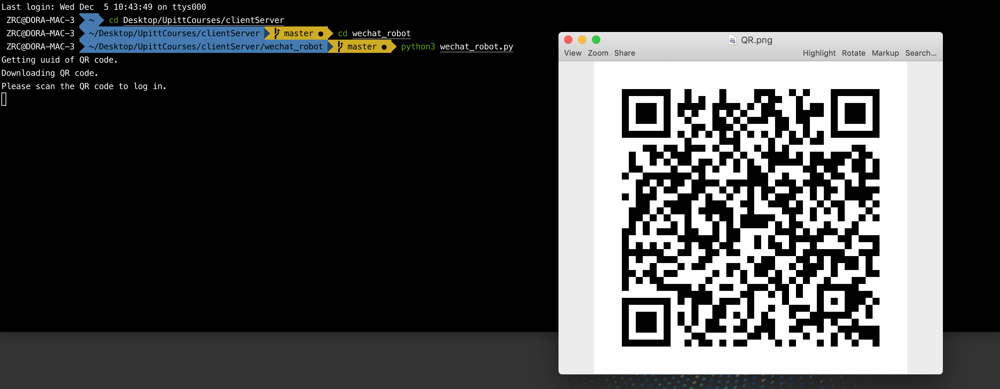

## Team member

- Ruochi Zhang [https://github.com/zhangruochi](https://github.com/zhangruochi)
- Zhehao Guo [https://github.com/PaulGuo5](https://github.com/PaulGuo5)
- Qi Lu [https://github.com/FawneLu](https://github.com/FawneLu)

## Thorough description of the project

We designed a automatic reply system for a very popular chatting app among Asian people which called “wechat”. Users can use this client server system to log in their own account and perform many functions.

Here are the functions and open source corpus that we use:

1. A Chinese language processor introduced from “Tuling” database.
2. A automatic translator based on google translate.
3. A automatic make-up function for portrait photograph based on facial recognition and image processing method.
4. A PDF ORC function to transform literature content in PDF file to txt form.

## Main open source parallel corpus (OPUS) and database we use

1. Baidu translation api from Baidu platform(Function : Translate English to Chinese)
2. **TULING** Chinese language corpus. (Function : Auto reply in Chinese)
    - http://www.tuling123.com/v1/kb/select (api interface)

## Function description and Demo
1. Auto Reply

We used Baidu translate api to frist translate English message into Chinese, and then use Tuling Chinese corpus to generate an auto reply and translate it back to English and send.

2. Auto make-up

Here we use our facial recognition methods to detect certain parts in human face(such as eyes, eyebrows and lips) and then do the image processing to add make-ups(lipsticks and eye lines). Finally we get the output picture with make-ups on.

3. PDF transform using PDF OCR technique

## Language and Framework
1. **Language**
    - Python==3.7.0
    - Python==2.7.15
2. **Framework**
    - for python3 
        - itchat==1.3.10
        - Pillow==5.3.0
        - pdfkit==0.6.1
        - face-recognition==1.2.3
        - requests==2.20.1
        - PyQRCode==1.2.1
    - for python2
        - pdfminer==20140328

## API
1. Downlaod wechat app in Apple Store or Andrid Store
2. Run in commandline: 
    > python3 wechat_robot.py
3. Scan the QR code

